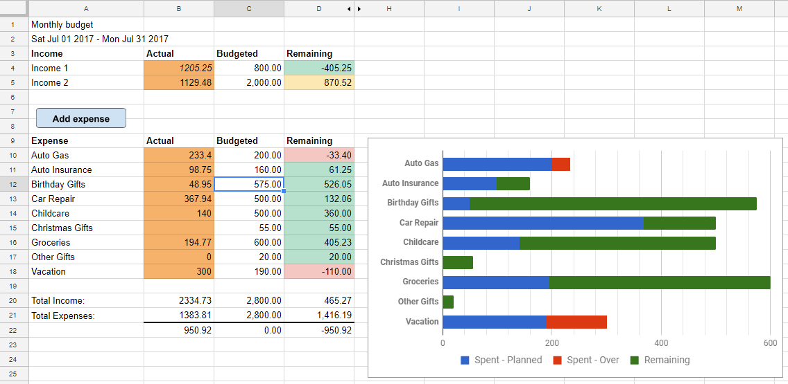

# Zero Based Budget

# Features
 - Based on [Google Sheet](https://docs.google.com/spreadsheets/d/180U2w59CrWu-zsyfjhfRDwYmiKDfZNKwgTrhOnoEQBw/pub?output=ods) from [StAmourD/BudgetSheet-Google-App-Script](https://github.com/StAmourD/BudgetSheet-Google-App-Script)
 - This project was bootstrapped with [Create React App](https://github.com/facebookincubator/create-react-app).

 

# Getting Started
//TODO

## Install ZBB
 - Clone this repo
 - Run `npm install` from the newly created folder
